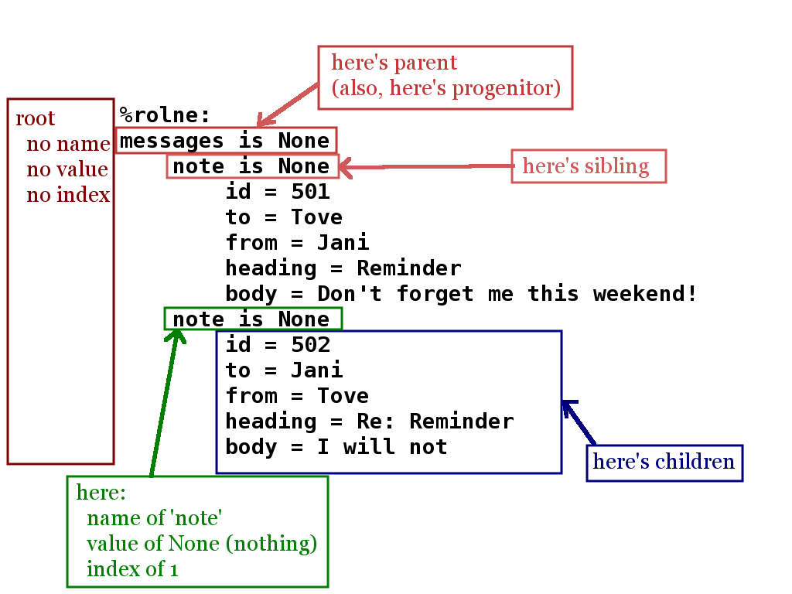

An Overview of **rolne**
========================

A **rolne** is a new data type that is *ultra-inclusive*. As such, it is a useful tool to interpret complex (and less-predictable) data sets such as XML documents, MARDS documents, and configuration files.

Comparing to Lists and Dictionaries
-----------------------------------

If you are already familiar with Python's dictionaries and lists, then the following might give useful insight into what I mean by *ultra-inclusive*:

A rolne is like a dictionary because it let's you use a name to reference an elements: ::

   >>> zippy["size"] = 4

A rolne is like a list because the elements are _ordered_ and can be referenced by a dynamic integer index.

   >>> zippy.append("fruit", "apple")
   >>> zippy.append("fruit", "bannana")
   >>> zippy.append("fruit", "orange")
   >>> zippy.list_values("fruit")
   ['apple', 'bannana', 'orange']
   
But,
   * In a dictionary, the *names* (keys) are unique. In a rolne, multiple items can (and often do) have the same name.
   * In a list, the place in the list is strictly an integer index. In a rolne, the place in the list is based both on the name, value, *and* index.

Let's Start with an Example
---------------------------

Let's borrow one of the examples from XML docs at w3schools.com (http://www.w3schools.com/xml/xml_attributes.asp): ::

   <messages>
     <note id="501">
       <to>Tove</to>
       <from>Jani</from>
       <heading>Reminder</heading>
       <body>Don't forget me this weekend!</body>
     </note>
     <note id="502">
       <to>Jani</to>
       <from>Tove</from>
       <heading>Re: Reminder</heading>
       <body>I will not</body>
     </note>
   </messages>

If this were parsed into a rolne, it would end up looking like this ::

   >>> my_xml
   %rolne:
   messages is None
       note is None
           id = 501
           to = Tove
           from = Jani
           heading = Reminder
           body = Don't forget me this weekend!
       note is None
           id = 502
           to = Jani
           from = Tove
           heading = Re: Reminder
           body = I will not

In this example, the *root* level of the **my_xml** has a single item in it: ::

   >>> my_xml.list_keys()
   [("messages", None, 0)]
   
Take note of the 'list' of keys: it contains one item. It has a **name** of ``"messages"``, a **value** of ``None``, and an **index** of zero (``0``). The index is zero because it is the *first* name/value pair to contain ``"messages"``/``None``.

If you wanted to see the *children* of messages, one could reference it by key: ::

   >>> my_xml["messages", None, 0]
   %rolne:
   note is None
       id = 501
       to = Tove
       from = Jani
       heading = Reminder
       body = Don't forget me this weekend!
   note is None
       id = 502
       to = Jani
       from = Tove
       heading = Re: Reminder
       body = I will not
   
Notice that **all three parts** of the key where used. That is a means of explicitly identifying one of the children. However, as a conveniece, you don't have to use all three parts. So, the following works the same:

   >>> my_xml["messages"]
   %rolne:
   note is None
       id = 501
       to = Tove
       from = Jani
       heading = Reminder
       body = Don't forget me this weekend!
   note is None
       id = 502
       to = Jani
       from = Tove
       heading = Re: Reminder
       body = I will not

If not specified, the following are the base assumptions:

 * name is <any>
 * value is None
 * index is 0

So, ``["messages"]`` is the same thing as ``["messages", None, 0]``.

Now, let's dive down further: ::

   >>> my_xml["messages"]["note", None, 1]
   %rolne:
   id = 502
   to = Jani
   from = Tove
   heading = Re: Reminder
   body = I will not

In this case, we are looking at the first ``"messages"``/``None`` and the second ``"note"``/``None``. Notice the ``1`` index. That reference the second item (but only of ``"note"``/``None`` items).

Relationships
-------------

Let me point a variable at the location. ::

   >> here = my_xml["messages"]["note", None, 1]
   
Now let's examine some of the relationships of the variable called "**here**":

So, let's try some stuff out: ::

   >>> here.name
   note
   >>> here.value
   None
   >>> here.index
   1
   >>> here.parents_name()
   messages
   >>> here.value("id")
   502
   >>> here.value("heading")
   Re: Reminder
   >>> here.list_values("to")
   ["Jani"]
   >>> here.list_values("to")[0]
   Jani
   >>> here.find("to")
   %rolne:
   empty
   >>> here.find("to").value
   Jani
   >>> here.find("to", "Jani", 0).value
   Jani
   >>> here["to"].value
   Jani
 
BTW, what is the difference between ``here.find("to")`` and ``here["to"]``. Allow me to demonstrate by search for a key that does not exist: ::

   >> here["blah"]
   Key Error...
   >> here.find("blah")
   None

Most of the expected behaviors one would expect from a pythonic class are supported. For example, iteration: ::

   >>> for item in here:
   ...     print "name='{}', value='{}', index={}".format(item.name, item.value, item.index)
   ...
   name='id', value='502', index=0
   name='to', value='Jani', index=0
   name='from', value='Tove', index=0
   name='heading', value='Re: Reminder', index=0
   name='body', value='I will not', index=0
   
And, of course, one can add/remove/update items:

   >>> here["to"].value = "Steve"
   >>> here["to"].value
   Steve
   >>> here.append("date", "2014-03-23")
   >>> here.append("code", [0, 39, 2])
   >>> del here["from"]
   >>> print here
   %rolne:
   id = 502
   to = Steve
   heading = Re: Reminder
   body = I will not
   date = 2014-03-23
   code = [0, 39, 2]
   
Added Bonus: Sequence References
--------------------------------

In addition the basics, rolne also supports 'meta' sequences strings. Essentially, as each element is added rolne a new tracking string is also assigned to the name/value pair. One can simply ignore this. It is not critical to rolne's use. But it can be a useful short cut for remembering where "something" is.

One can see the sequences by using the ``._explicit()`` method: ::

   >>> print here._explicit()
   %rolne:
   [19] id = 502
   [20] to = Steve
   [22] heading = Re: Reminder
   [23] body = I will not
   [32] date = 2014-03-23
   [33] code = [0, 39, 2]

Some items to take note of:

 * Don't try to "predict" the auto-numbering. You can only count on it's consistence within the context of a single rolne instance. There is no guarantee you will get the same numbering every time you run your program.
 
 * Changing the **name** or **value** (or **index**) of an element does NOT change its sequence. The sequence is only set on insertion.
 
You can purposely set your own key. The rolne simply checks to make sure the seqence given is unique. ::
 
    >>> here.append("something", True, seq="hello")
    >>> print here._explicit()
   %rolne:
   [19] id = 502
   [20] to = Steve
   [22] heading = Re: Reminder
   [23] body = I will not
   [32] date = 2014-03-23
   [33] code = [0, 39, 2]
   [hello] something = True
    
Conclusion
----------

You have just been given a quick summary. There is actaully far more to things than this. For example, one can:

 * 'replace' child lines with other rolnes or child lines
 * copy with prefix and suffix clauses for sequences
 * list the lineage of any element
 
And lot's more. Have fun.
 